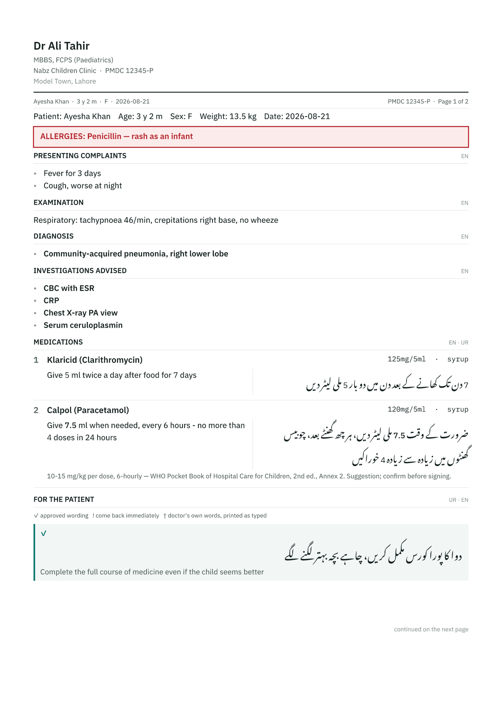

<div align="center">


**Bilingual clinical prescriptions that never leave the doctor's device.**

*نبض — a pulse.*

[How it works](https://itskaero.github.io/nabz/) ·
[What &amp; why](PRODUCT.md) ·
[How to build](CLAUDE.md) ·
[How it looks](DESIGN.md)

</div>

---

A private-clinic doctor writes the whole script — problems, examination,
diagnosis, investigations, medications, advice — and prints a signed document
whose **patient-facing instructions are in proper Nastaʿlīq Urdu**.

The Urdu is composed from structured data with its own authored word order. It
is never machine-translated, and it is never the English with the words swapped.

Records live on the device. No server holds anything clinical.

<table>
<tr>
<td width="50%" valign="top">

**What it does**

- English clinical record + Urdu patient instructions, from one stored object
- Investigations, exam findings and advice as fast tap-chips
- WHO and CDC growth charts, computed once and stored with their reference
- A real PDF at exact mm dimensions — preview *is* print
- An optional clinic queue for practices with a front desk

</td>
<td width="50%" valign="top">

**What it refuses to do**

- Machine-translate a single word of patient prose
- Fill a dose, frequency or duration on your behalf
- Carry clinical content between visits without you asking
- Put a diagnosis, a drug or an examination on any server
- Suggest an investigation or a drug from a diagnosis

</td>
</tr>
</table>

---

## What it prints



Real output from the PDF renderer, not a mockup. The English is the clinical
note and the pharmacist's check; the Urdu block beside each medicine is what the
family takes home.

---

## Getting started

```bash
npm install
npm run assets      # fetch WHO/CDC growth tables + the OFL fonts
npm run dev
```

`npm run assets` is required on a fresh clone — see "Assets are fetched, not
committed" below.

```bash
npm test            # 292 tests
npm run build       # typecheck + production build
npm run preview     # serve the built PWA
```

### Running it as a server

```bash
npm start              # serves the built app and NOTHING else — no data endpoint
npm run start:clinic   # reception station: also shares the queue on the LAN
```

`npm start` is what a host like Railway runs. It hands over the app bundle; every
record lives in the browser on the doctor's device, so a hosted instance holds no
patient data — there is nowhere for it to go.

Clinic mode adds exactly one endpoint, carrying **patients and queue rows only**.
The server whitelists those fields independently of the client, so a client bug
cannot write a prescription onto a shared machine. `tests/server.test.ts` posts
clinical content at a live server and asserts the disk never sees it.

### Two stations disagreeing

The station prints a **six-digit pairing code** on startup; a doctor's device
types it once, in the queue view. Without it the endpoint answers 401, so a
phone on the clinic wifi cannot fetch the patient list by guessing a URL. It is
not encryption -- the LAN traffic is plain HTTP -- and it is not meant to be.

Rows carry `updatedAt`, plus separate stamps for the two fields two people
genuinely edit at once: **reception owns the money, the doctor owns the room.**
Merging those independently is what stops this, which a live probe of the first
implementation reproduced every time:

```
09:00  reception queues Ayesha and takes payment   -> paid
09:05  doctor (synced before that) marks her done
09:06  doctor syncs  -> payment silently reverts to unpaid
```

Deletions are tombstones for 30 days, because a hard delete is indistinguishable
from "that row has not reached me yet" and the next stale sync simply re-adds a
visit nobody made. Syncs are incremental (`?since=`) and the queue view polls
every ten seconds while it is open, so a patient added at reception appears on
the doctor's tablet without anyone pressing anything. The four scenarios are in
`tests/server.test.ts` under *two stations disagreeing*.

### The clinic station (.exe)

```bash
npm run build:exe      # -> release/nabz-clinic.exe  (~94 MB, self-contained)
```

One file. The whole built app -- HTML, JS, the HarfBuzz WASM, the Nastaliq font
-- is embedded inside the binary as Node SEA assets, so a clinic copies it onto
the reception PC and double-clicks it. It prints the LAN address a doctor's
tablet should open, and writes the queue to `.clinic-data` beside itself.

**Not Electron.** There is no bundled browser: the machine's own browser opens
the app, so the PWA behaves exactly as it does anywhere else -- same service
worker, same IndexedDB, same install prompt -- and the download is the Node
runtime rather than Node plus Chromium.

What that machine holds: the queue. What it does not hold: prescriptions,
examinations, growth records. The server drops them even if something asks it to.

### Deploying the demo

`railway.json` and `nixpacks.toml` are committed, so a Railway deploy is:

```bash
railway init          # once, in this directory
railway up
```

Railway runs `npm run build:deploy` (which fetches the WHO/CDC tables and the
fonts first, since neither is committed) and then `npm start` -- **serve** mode,
which has no data endpoint at all. A public demo therefore holds no patient
data: anything a visitor types stays in their own browser, and vanishes when they
clear it.

`healthcheckPath` is `/healthz`. Set `NABZ_MODE=clinic` on a public host and it
refuses to start, because the clinic layer holds patient identity and that
belongs on a clinic's own machine, not one we operate.

Two more checks write files, so they are not part of `npm test`:

```bash
npm run artifact:pdf      # -> artifacts/sample.pdf   a real script, for a real printer
npm run artifact:visual   # -> artifacts/visual/*.png rasterised pages, to look at the Nastaliq
```

---

## What is here

```
src/
  domain/     pure clinical logic — no React, no DOM, no storage
    sig.ts        structured medication line -> a sentence, per locale
    phrases.ts    locale-pack shape, template grammar, cross-locale validation
    pluralize/    per-locale number grammar
    bidi.ts       LTR-inside-RTL isolation (a safety file, not a formatting one)
    exam.ts       findings-chip state model -> English prose
    labs.ts       investigations: ordered or not, plus a qualifier (en only)
    advice.ts     the three advice tiers and what the app vouches for
    deviceRole.ts what a machine is for; a front desk cannot store a script
    secureContext.ts  a plain-http origin has no crypto.subtle -- say so loudly
    growth/       LMS -> z-score -> percentile
    pack.ts       ContentPack + the "no dose without a citation" validator
  data/       content: locale packs, formulary seed, dosing seed, paeds pack,
              growth tables (generated)
  config/     appDefaults (shipped) and doctorProfile (per-doctor) — kept apart
  storage/    IndexedDB + encrypted export/import
  render/
    text/     HarfBuzz shaping + bidi line layout
    pdf/      page model, document layout, PDF and SVG backends
    screen/   the React app
      builder/  the pack builder — content authoring + its refusals
  app/        PWA entry
server/       the clinic station: serves the app, shares the queue, issues its
              own TLS certificate. Plain JS so the packaged .exe needs no build.
docs/         the project site (GitHub Pages)
```

---

## Three decisions worth knowing before you read the code

### 1. Text is shaped by HarfBuzz and drawn as outlines

The obvious build is pdf-lib + fontkit with Noto Nastaliq Urdu embedded. It does
not work: fontkit throws on that font's GPOS anchors (`Cannot read properties of
null (reading 'xCoordinate')`), and does the same on every Nastaliq face tried.
Naskh Arabic faces shape fine — which is the trap, because the pipeline would
look healthy while printing Urdu in the wrong script.

So `render/text/engine.ts` shapes with HarfBuzz (the engine browsers use) and
emits glyph outlines. The PDF backend and the on-screen preview draw the *same*
outlines at the *same* coordinates, which makes "preview == print" structural
rather than aspirational. The cost, accepted deliberately: text in the PDF is not
selectable. The delivery format is paper handed to a parent.

### 2. Assets are fetched, not committed

`npm run assets` pulls:

- **Growth tables** — WHO Child Growth Standards (0–5y) and WHO Growth Reference
  (5–19y) from WHO's own reference implementations, plus CDC 2000 from NCHS.
  ~17,000 LMS rows, stored with the source URL for every range. A percentile bug
  is a clinical-safety bug, so nobody types these by hand and nobody edits the
  generated file.
- **Fonts** — Noto Nastaliq Urdu, IBM Plex Sans, IBM Plex Mono (all SIL OFL 1.1),
  with a manifest of sizes and hashes.

If they are missing, the growth module refuses to compute and the renderer
refuses to draw. Both fail loudly. Neither falls back.

### 3. The pack builder edits content; the app refuses to run bad content

Settings → *Open the pack builder* edits everything specialty-specific: the drug
catalogue, the cited dosing, the EN/ur-PK phrase library, the advice tiers and
the exam chips. It is a route in this app, lazy-loaded, and it needs no server —
a pack holds no patient data, which is why its export is plain shareable JSON
while a records backup is encrypted.

Its real job is refusing. Export is blocked on an uncited dose, a DRAP claim
with no registration number, a phrase written in one language and not the other,
locales whose slot sets have drifted apart, an unsigned red flag, or one generic
spelled two ways. Those are the failures that reach a patient without anything
on the printed script looking wrong.

Edited content lives in IndexedDB and overrides the shipped packs — but only if
it validates. If it does not, the app runs on the shipped packs and says so
rather than degrading quietly (`src/data/provider.ts`).

Two details worth knowing:

- **Generic names are derived, not sourced.** The join from `formulary` to
  `dosing` is on `generic`, so a typo silently returns no dose. Autocomplete
  comes from the pack's own ~100 generics and an edit-distance check blocks a
  near-duplicate. An external list was considered and rejected: DRAP has no bulk
  download, the WHO EMLc publication is CC BY-NC-SA (non-commercial, conflicting
  with the v2 paid tier), and RxNorm is online-only against an offline-first app.
- **Red flags need a named sign-off.** Tier 2 is library-only because a
  mistranslated return precaution can hurt a child, and no validator can catch a
  *wrong* translation — only a missing one. So a red flag carries what a dose
  carries: a person, on a date, saying they read it. Editing the wording clears
  the signature.

### 4. Two layers, and only one of them can ever be shared

| Layer | Holds | Lives |
|---|---|---|
| **Clinic** | patients, queue, paid status, visit fee | shared when a clinic runs two stations |
| **Clinical** | prescriptions, growth, examination, learned vocabulary | always the doctor's device |

A receptionist cannot read clinical content because **it is not on their
machine** — a boundary enforced by which data exists rather than by a permission
flag. It is also what keeps rule 3.1 literally true: a shared box holds a name
and a paid flag, never a diagnosis.

Solo mode is the degenerate case: both layers on one machine, nothing syncs,
identical code path. The clinic layer is off by default and a doctor working
alone never meets it.

### 5. Two databases, joined on generic

`formulary` is the catalogue (brand → generic, strength, form) and `dosing` is
the evidence (generic → mg/kg, with a **mandatory citation**). They are separate
tables so commercial catalogue data can never become prescribing evidence. A test
fails the build if any dosing row has an empty `reference`.

---

## Status of the shipped content

The code is complete; three pieces of **content** need a clinician before this
goes near a patient.

- **`src/data/formulary/seed.ts`** — ~150 real Pakistani paediatric brands, all
  marked `provenance: 'manual'` with no DRAP registration number. This is a
  starting vocabulary for name-autocomplete, not a verified extract of the DRAP
  registry. Reconcile each row against DRAP before clinical use; the validator
  refuses any row claiming `'DRAP'` provenance without a registration number.
- **`src/data/dosing/seed.ts`** — ten entries, drawn only from WHO's openly
  licensed paediatric guidance, every one marked `verified: false` and labelled
  as unverified in the UI. They exist to prove the citation pipeline end to end.
  The pack author authors and verifies the real ones.
- **`src/data/phrases/ur-PK.ts`** — plain patient-register Urdu, but PRODUCT.md
  §15 is explicit that the validators are real patients and pharmacists, not the
  person who wrote the code. Treat it as a first draft awaiting that pass.

No non-paediatric content pack is shipped, on purpose. The schema is open; the
content is not ours to write.

---

## What is deliberately absent

No cloud sync, no accounts, no licence enforcement (all v2). No interaction
checker. No auto-translation anywhere. No geo-locking. No national formulary. No
chips on diagnosis. No bulk-parsing of copyrighted reference PDFs.

And two rules the code structure enforces rather than documents: nothing loads a
prior prescription by matching a patient, and the app never fills a clinical
value the doctor did not choose.

**Known spec gap:** the pack builder is specified in `DESIGN.md` §12 but is not
scoped anywhere in `PRODUCT.md` §4 — not v1, not v2+, not Never. It is built and
shipping regardless; `PRODUCT.md` should say where it belongs.

---

<div align="center">
<sub>

Not a medical device. Clinical content is authored and reviewed by a clinician
before use — the app validates that a translation exists, never that it is right.

</sub>
</div>
